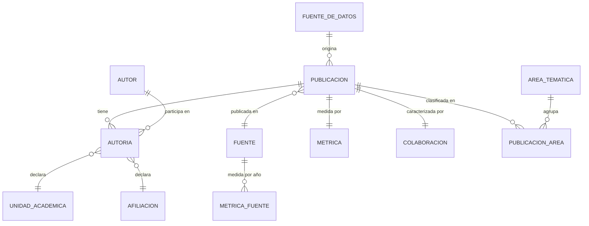

# Modelo lógico preliminar

**Capa:** pública · **Fase:** 1 · **Estado:** preliminar, sujeto a Fase 2

---

## Diagrama

`AUTORIA` es la entidad puente sin la cual el modelo no puede representar que
la afiliación de un autor cambia entre publicaciones.

---

## Entidades

| Entidad | Campos | Fuente | Relación | Observaciones |
|---|---|---|---|---|
| **Publicacion** | `eid` (PK), `doi`, `titulo`, `anio`, `tipo_documental`, `fuente_titulo`, `en_scopus`, `en_scival`, `tiene_metricas`, `tiene_autoria_detallada`, `tiene_area_tematica` | Scopus CSV ∪ SciVal XLSX, join por `eid` | 1:N `Autoria`; N:1 `Fuente`; 1:1 `Metrica`; 1:1 `Colaboracion`; N:M `AreaTematica` | **823 registros.** Las banderas de disponibilidad determinan el denominador de cada indicador |
| **Autor** | `autor_id` (PK), `scopus_author_ids`, `nombre_en_fuente`, `clave_normalizada`, `clave_apellido`, `orcid`, `n_publicaciones`, `anio_min`, `anio_max`, `confianza_maxima` | Scopus CSV | 1:N `Autoria` | **589 autores.** 575 con Scopus Author ID. `orcid` existe y está vacío: declarado no disponible, no omitido |
| **Autoria** | `eid` (FK), `autor_id` (FK), `posicion_autor`, `n_autores_total`, `afiliacion_declarada_raw`, `unidad_academica`, `metodo_blando`, `metodo_duro_publicacion`, `confianza` | `Authors with affiliations` (Scopus) + `Scopus Affiliation IDs` (SciVal) | N:1 `Publicacion`; N:1 `Autor` | **1.207 filas** = apariciones firma × publicación; 1.205 pares distintos. Entidad central: aquí vive la afiliación (ver METHODOLOGY §2) |
| **Afiliacion** | `afiliacion_id` (PK), `scopus_affiliation_id`, `nombre_normalizado`, `cadena_raw`, `es_institucion_foco` | Scopus + SciVal | N:M `Publicacion` vía `Autoria` | `60105368` = UFT, parametrizado en `config/institution.yml`. **421 cadenas literales distintas** |
| **UnidadAcademica** | `unidad_id` (PK), `nombre_canonico`, `variantes[]` | Parsing de la cadena de afiliación | 1:N `Autoria` | Cobertura **63,8 %** de los pares. Vocabulario **validado institucionalmente** (`T-02`, 2026-08-26; `vocabulario_validado_por_institucion: true`). `No determinada` es categoría de primera clase |
| **Fuente** | `fuente_id` (PK, `Source ID` SciVal), `titulo`, `issn`, `editorial`, `tipo_fuente` | SciVal + Scopus | 1:N `Publicacion`; 1:N `MetricaFuente` | `Source ID` es mejor clave que el ISSN |
| **MetricaFuente** | `fuente_id` (FK), `anio`, `snip`, `snip_pct`, `citescore`, `citescore_pct`, `sjr`, `sjr_pct` | SciVal | N:1 `Fuente` | **Separada de `Metrica` a propósito**: describe la revista, no el artículo |
| **Metrica** | `eid` (FK), `citas`, `fwci`, `field_citation_average`, `views`, `fw_view_impact`, `top_citation_percentile`, `fecha_corte`, `fuente_metrica` | SciVal | 1:1 `Publicacion` | `fecha_corte = 2026-07-22`, obligatoria en todo despliegue. Disponible en 816/823 |
| **AreaTematica** | `area_id` (PK), `esquema`, `codigo`, `nombre` | SciVal | N:M `Publicacion` vía `PublicacionArea` | Esquemas: ASJC, Topic, QS, THE, ANZSRC, ODS. **Multivaluado: no sumable** |
| **PublicacionArea** | `eid` (FK), `area_id` (FK), `esquema` | SciVal | — | Necesaria por la multivaluación |
| **Colaboracion** | `eid` (FK), `n_paises`, `paises[]`, `n_instituciones`, `instituciones[]`, `sectores[]`, `es_internacional` | SciVal | 1:1 `Publicacion` | Nivel publicación. La red autor–autor es derivable de `Autoria`; se difiere a Fase 2 |
| **FuenteDeDatos** | `fuente_datos_id` (PK), `nombre`, `archivo`, `rol`, `fecha_corte`, `fecha_export`, `ventana`, `filtros`, `n_registros` | `config/sources.yml` | Referenciada por todas | Materializa el requisito de trazabilidad |

---

## Claves de enlace

| Enlace | Clave | Cobertura |
|---|---|---|
| Scopus ↔ SciVal | `EID` | 811 de 823 |
| Publicación → Fuente | `Source ID` (SciVal) | 816 de 823 |
| Autoría → Autor | `Scopus Author ID` | 575 de 589 autores |
| Publicación → externo | `DOI` | 97,7 % |
| Autoría → Institución | `Scopus Affiliation ID` | 811 de 823 |

`EID` es la única clave primaria sólida: 100 % de cobertura, cero duplicados.
`DOI` no sirve como PK (19 registros sin DOI).

---

## Campos declarados como no disponibles

Se modelan y quedan vacíos, con la razón explícita. No se omiten del esquema.

| Campo | Estado | Vía de recuperación |
|---|---|---|
| `Autor.orcid` | No existe en ninguna fuente | Crossref por DOI, repositorio institucional UFT, ORCID Public API. **Pendiente de Fase 2/3** |
| `Afiliacion.ror_id` | No verificado | Registro ROR |
| `UnidadAcademica` oficial | Sin catálogo institucional | Validación con la universidad |
| `scopus_export.fecha_corte` | No declarada por el export | Reexportar con fecha registrada |

## Corpus paralelo declarado (fuera de este modelo)

`data/processed/produccion_declarada.json` no es parte del diagrama de
arriba: agrega TRES fuentes de otra naturaleza que el resto del modelo,
cada una fuera del universo Scopus/SciVal y ninguna unida jamás a
`Publicacion` ni a ningún indicador de este modelo — mezclar criterios de
indexación distintos sin declararlo sería exactamente el error que este
proyecto evita (D-206, D-398):

- `PD-01` (clave `por_facultad_anio`): recuento agregado (Facultad × año) de
  publicaciones que una Facultad declara en su propio sitio. Nivel D
  (declarado, no verificado obra por obra). Ver `docs/FUENTES_Y_APIS.md`
  §2.6, `config/sources.yml` → `facultad_medicina_publicaciones`.
- `PD-02` (clave `openalex_cobertura`): recuento agregado (por año, sin
  Facultad) de publicaciones que OpenAlex atribuye a la institución y un
  humano confirmó caso por caso (V2-26) que el universo no tiene. Nivel V
  (verificado por revisión humana, no por fuente independiente). Ver
  `docs/FUENTES_Y_APIS.md` §2.7, `internal/openalex_cobertura.csv`.
- `PD-03` (clave `autoarchivo_produccion`): recuento agregado (Facultad ×
  año) de publicaciones que sus propios autores autoarchivaron en el
  repositorio institucional. Nivel D, pero con un límite propio: la
  Facultad/Escuela declarada por biblioteca viene en bruto, así que sólo se
  agrega por Facultad donde esa relación está validada
  (`config/matching_rules.yml`); el resto se publica por unidad declarada,
  en `unidades_sin_mapeo`, nunca forzado a una Facultad. Ver
  `docs/FUENTES_Y_APIS.md` §2.8, `data/enriched/autoarchivo_produccion.json`.
- `PD-04` (clave `obras_externas`): recuento agregado (por año, sin Facultad)
  de obras que DataCite, Europe PMC o Zenodo atribuyen a una firma o a la
  afiliación institucional, y que un humano confirmó caso por caso que el
  universo no tiene — datasets, software, preprints, materiales depositados.
  Nivel V, como `PD-02`, pero con clave de identidad y vocabulario de
  veredictos propios. Su recuento llega YA colapsado entre sus tres fuentes:
  el mismo DOI en dos repositorios es una obra, no dos. Ver
  `docs/FUENTES_Y_APIS.md` §2.10, `internal/obras_externas_cobertura.csv`.

La clave `total_fuera_de_scopus` es la unión por DOI de las cuatro —
aritmética sobre PD-01, PD-02, PD-03 y PD-04, no un quinto indicador con
fuente propia; hay solapamiento real entre ellas (verificado, no asumido) y
se resta antes de sumar. Ver `docs/METODOLOGIA_FUERA_DE_SCOPUS.md` para el
marco general de niveles de evidencia.
